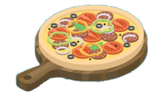
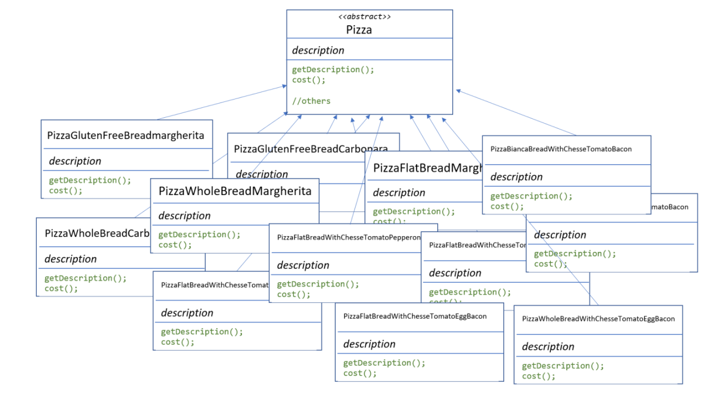
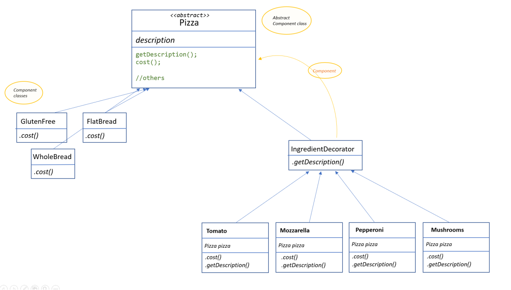
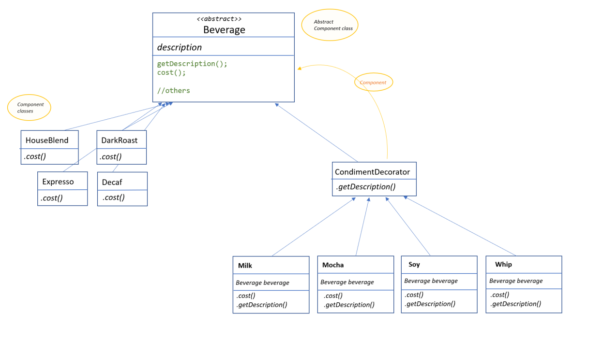

# Decorator Pattern
The Decorator Pattern attaches additional responsibilities to an object dynamically (without altering its structure)
Decorators provide a flexible alternative to subclassing for extending functionality.

We will try to use composition over inheritance in this pattern, so we can reduce the overhead of subclassing again and again for each decorating element.

## The problem
When we have one or several objects, and we want to add functionalities or features, dinamically. These functionalities can be added to the objects, and the objects can have one, several functionalities/features, or none. 

**For example**: We have pizzas, different kind of pizzas: the bread can be flat, whole wheat bread, focaccia, gluten-free. And we can add different ingredients: tomato, mozzarella, mushrooms, pepperoni... 



**Another example**: We can have a online/virtual shop where we sell gadgets: phones, tablets, pcs, etc..  When you buy a product you can choose several things about the product: add a cover, a plastic screen protector, you can ask a special colour, your name printed with laser or an express shipping. 

We could think a lot of examples: ice creams and toppings (chocolate, cookies, almond, fruits...), cars and accessories or extra equipament...

Always we have one object: the base, the decorated object. <br />
And additional things added: responsabilities, features, ingredients, toppings, the decorators. 

And, of course, add this decorators means altering some properties: prize, time, description, the way to create/do them...


And how can we **implement** these scenarios? 

Let's think about the pizza first example: 



Erm... yes. I know. <br />
It doesn't seem very clean. And it break at least two SOLID principles: we are not having a Single responsability for each class, nor the Open/Close principle: for example, if the price of one ingredient change, we need to change all the classes with that ingredient. 

## The solution
The goal is to have classes that we can easily extend, adding new features (behaviour, ingredients, toppings) dinamically, without modifying the existing code. 

So, we will have one abstract class that represent the decorated object: pizza, coffee, ice cream, car, etc... (component) <br />
And then we have the decorators: each decorator has a property that is the variable that holds the reference to the decorated object (decorator).



Now the key of the pattern is how to implement the methods (getDescription and getCost).

We have a basic description that owns to the component. "Gluten-free bread pizza". And also a price for that type of pizza: "12€". 

De decorators will have a reference to the component, and will add something to the description and the cost. 
_"Gluten-free bread pizza" + " with tomato"_ .

### How to use it? 

The component is an abstract class (Pizza). And the concrete components are classes that implement that abstract class.

The Decorators are concrete classes that extends an abstract decorator. (IngredientsDecorator)
These decorators needs to have a reference to the component they are decorating. 
So, when they implement the methods ("getCost" or "getDescription"), the component method will be called and to that behaviour, data, information, that the decorator adds. 

## Another example with coffees 
You can see in this repository the implementation of this pattern with coffees. That is the one that the book ["Head First Design Patterns"](https://www.oreilly.com/library/view/head-first-design/0596007124) offers: 



Here, you can see that for C# I've implemented a little bit different the method <code> getDescription</code> and <code> Cost()</code>.

<code> getDescription</code>, it just the getter of the description property. 

In the abstract component you can see:

``` 
public virtual string Description { get; protected set; } = "Unknown Beverage";
``` 

The concrete components implement the constructor setting the Description property and the method <code>Cost()</code> like this: <br>
_for example [Decaf.cs](Coffee/Components/Decaf.cs)_

``` 
public Decaf() {
    this.Description = "Decaf Roast";
}

public override double Cost() {
    return 1.05;
}
``` 
And then the concret decorators (condiments), implement the getter of Description and the method <code>Cost()</code> like this: <br>
_for example [Soy.cs](Coffee/Decorators/Soy.cs)_

``` 
public override string Description => _beverage.Description + ", Soy";

public override double Cost(){
    return .15 + _beverage.Cost();
}
``` 

Then [Program.cs](Coffee/Program.cs) create an Espresso (without toppings/condiments)

``` 
Beverage beverage = new Espresso();
Console.WriteLine(beverage.Description + ": " + beverage.Cost() +"€");
``` 

And also a Dark Roast, with two shots of mocha, and Whip, using the component and decorator constructors like this: 

``` 
Beverage beverage2 = new DarkRoast();
beverage2 = new Mocha(beverage2); //wrap it with a mocha
beverage2 = new Mocha(beverage2); //wrap it with a second mocha
beverage2 = new Whip(beverage2); //wrap it with a Whip
Console.WriteLine(beverage2.Description + ": " + beverage2.Cost() +"€");
``` 