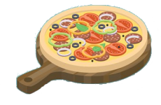
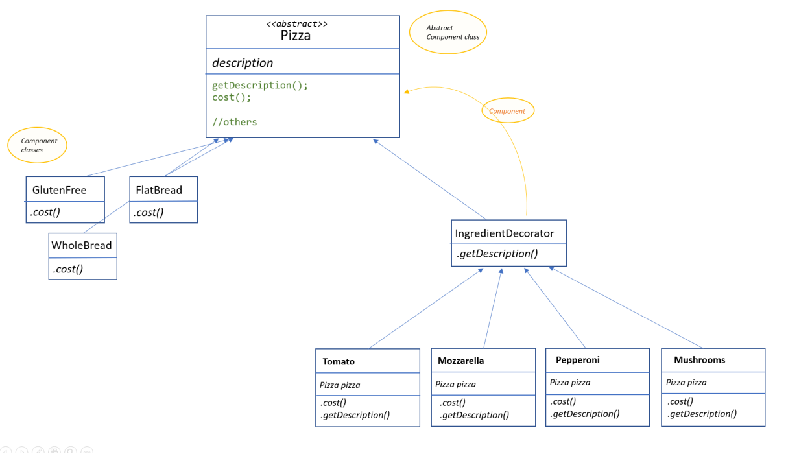

# Decorator Pattern
The Decorator Pattern attaches additional responsibilities to an object dynamically (without altering its structure)
Decorators provide a flexible alternative to subclassing for extending functionality.

We will try to use composition over inheritance in this pattern, so we can reduce the overhead of subclassing again and again for each decorating element.

## The problem
When we have one or several objects, and we want to add functionalities or features, dinamically. These functionalities can be added to the objects, and the objects can have one, several functionalities/features, or none. 

**For example**: We have pizzas, different kind of pizzas: the bread can be flat, whole wheat bread, focaccia, gluten-free. And we can add different ingredients: tomato, mozzarella, mushrooms, pepperoni... 



**Another example**: We can have a online/virtual shop where we sell gadgets: phones, tablets, pcs, etc..  When you buy a product you can choose several things about the product: add a cover, a plastic screen protector, you can ask a special colour, your name printed with laser or an express shipping. 

We could think a lot of examples: ice creams and toppings (chocolate, cookies, almond, fruits...), cars and accessories or extra equipament...

Always we have one object: the base, the decorated object. <br />
And additional things added: responsabilities, features, ingredients, toppings, the decorators. 

And, of course, add this decorators means altering some properties: prize, time, description, the way to create/do them...


And how can we **implement** these scenarios? 

Let's think about the pizza first example: 


Erm... yes. I know. <br />
It doesn't seem very clean. And it break at least two SOLID principles: we are not having a Single responsability for each class, nor the Open/Close principle: for example, if the price of one ingredient change, we need to change all the classes with that ingredient. 

## The solution
The goal is to have classes that we can easily extend, adding new features (behaviour, ingredients, toppings) dinamically, without modifying the existing code. 

So, we will have one abstract class that represent the decorated object: pizza, coffee, ice cream, car, etc... (component) <br />
And then we have the decorators: each decorator has a property that is the variable that holds the reference to the decorated object (decorator).



Now the key of the pattern is how to implement the methods (getDescription and getCost).

We have a basic description that owns to the component. "Gluten-free bread pizza". And also a price for that type of pizza: "12€". 

De decorators will have a reference to the component, and will add something to the description and the cost. 
_"Gluten-free bread pizza" + " with tomato"_ .

### How to use it? 

The component is an abstract class (Pizza). And the concrete components are classes that implement that abstract class.

The Decorators are concrete classes that extends an abstract decorator. (IngredientsDecorator)
These decorators needs to have a reference to the component they are decorating. 
So, when they implement the methods ("getCost" or "getDescription"), the component method will be called and to that behaviour, data, information, that the decorator adds. 

## Another example with superheroes 


You can see in this repository the implementation of this pattern with Lego superheroes.

Imagine a Lego store specialized in Super heroes: 


And this store, as most of the Lego stores, has a section where you can create your own mini-figure, picking different bodies, heads, complements:

 


Here, you can choose the superhero/superheroine you want:

Like Superwoman, Batman, Catgirl, Spiderman, Captain Marvel...<br> 
_yes, sorry, in our store DC, Marvel, and others are all mixed..._ 


And then you can buy some accessories for them: a cape, a belt, a mask, a shield, a sword... <br>
Can you buy a sword to Superwoman? Yes: the doll hand of Superwoman is exacly the same than the hand of Wonderwoman, so you _could_ add any accessory.
It's *your* responsability choosing the right one. 


<br>We have a lot of accessories for our Super heroes/heroines.

And sorry about this, but they don't have all the same prize. The cape is much more cheaper than the mask, and they are much more cheaper than the batcar.
But if you buy a shield (for example), it's the same prize if you buy it for Captain America than for Wonderwoman. 

So, let's see the implementation:

We have an abstract class "Superhero" for the components. And several concret components: the superheroes and superheroines themselves: Superwoman, batgirl, Captain Marvel, Spiderman, etc...

They have a description and an original prize. 

Then we can buy complement to the uniform, or accessories: We have masks, shields, weapons, swords, belts, 


Here, you can see that for C# I've implemented a little bit different the method <code> getDescription</code> and <code> Cost()</code>.

<code> getDescription</code>, it just the getter of the description property. 

In the abstract component you can see:

``` 
public virtual string Description { get; protected set; } = "Unknown Superhero";
``` 

The concrete components implement the constructor setting the Description property and the method <code>Cost()</code> like this: <br>
_for example [Superwoman.cs](Superhero/Components/Superwoman.cs)_

``` 
public Superwoman() {
    this.Description = "Superwoman";
}

public override double Cost() {
    return 23.4;
}
``` 
And then the concret decorators (accessories), implement the getter of Description and the method <code>Cost()</code> like this: <br>
_for example [Shield.cs](Superhero/Decorators/Shield.cs)_

``` 
public override string Description => _figure.Description + ", with shield";

public override double Cost(){
    return .15 + _figure.Cost();
}
``` 

Then [Program.cs](Superhero/Program.cs) create an Superwoman without any accessory

``` 
Superhero figure = new Superwoman();
Console.WriteLine(figure.Description + ": " + figure.Cost() +"€");
``` 

And also a Wonderwoman, with two swords and one shield, using the component and decorator constructors like this: 

``` 
Superhero figure2 = new Wonderwoman();
figure2 = new Shield(figure2); //wrap it with a  Shield
figure2 = new Sword(figure2); //wrap it with Sword
figure2 = new Sword(figure2); //wrap it with a another Sword
Console.WriteLine(figure2.Description + ": " + figure2.Cost() +"€");
``` 

And the answer will be:

``` 
Superwoman: 23.4€
Wonderwoman, with shield, with sword, with sword: 28.42€
``` 