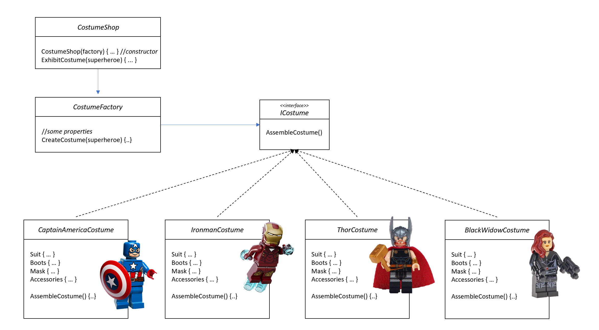

# Factory Patterns

Here we would like to describe different approaches about using a Factory in your code. We can identify 3 different patterns, described in details below: the *Simple Factory*, the *Factory Method* and the *Abstract Factory*.

# Simple Factory

In the *Simple Factory* scenario, we basically have a factory class that is responsible for creating different types of object, based on a given input.

## Problem

We want our code to be flexible, so we decided to program to an interface, not an implementation. However, somewhere in our code we need to instantiate new objects, obviously. If we have multiple classes implementing the same interface and we need to instantiate different objects depending on a parameter, our code might become difficult to read and less flexible than what we expected.

Let's visualize the problem using a small example:

```cs
ICostume ViewCostume() {

  ICostume costume;

  if(captainAmerica) {
    costume = new CaptainAmericaCostume();
  } else if(ironman) {
    costume = new IronmanCostume();
  } else if(thor) {
    costume = new ThorCostume();
  } else if(blackWidow) {
    costume = new BlackWidowCostume();
  } ...

}
```

What if we want to add even more superheroes? This code is not as flexible as we thought when we created the `ICostume` interface, especially if this is part of a class that handles also the business logic of the application: every time that we add a new type of costume implementing the interface, we also need to change this code.

## Solution

The simplest solution is to encapsulate the objects creation moving that code in a `CostumeFactory` class:

```cs
public class CostumeFactory {

  public ICostume CreateCostume(string superheroe) {

    // to add a new superheroe costume, we just add a case in the factory switch
    return superheroe switch
    {
      "CaptainAmerica" => new CaptainAmericaCostume(),
      "Ironman" => new IronmanCostume(),
      "Thor" => new ThorCostume(),
      "BlackWidow" => new BlackWidowCostume(),
      // we use this class to notify if a costume is not available
      _ => new UnavailableCostume(),
    };
  }
}
```

### Advantages of this solution

This might seem just a small trick, but the `factory` class has some interesting advantages:

- it can serve multiple classes
- it's the only place to change in case we need to add more superheroe costomes (besides the creation of the new class implementing the `ICostume` interface, obviously)
- it might be `static`: in that case you can use the `create` method without instantiating the object, but you lose the opportunity to subclass and change the behavior of that method

## How to use it

In the *SimpleFactorySample* folder you can find a small console application using the simple factory.



As you can see, the shop requires a factory to be able to actually instantiate the different costume objects. In this application, we actually have 2 `CostumeShops` using the same factory, and you can easily view all the superheroes' costumes in both shops.
Whenever we want to add a new costume, we just need to create a new class implementing `ICostume` and add a new `case` in the `switch` statement of the `CostumeFactory`, so that the costume can be available to all shops using that factory.

### How to run

To run the sample app, you just need to run this commands:

```ps
cd SimpleFactorySample
dotnet run
```

This is the initial ouput you should see:

```
---- Shop1 ----
-> Exhibit Ironman costume in the shop window: > Ironman's costume:
Red armor showing arc reactor
Red jet-boots
Red and gold helmet.
This is the list of accessories: Jarvis Gloves with repulsor rays
-> Exhibit Batman costume in the shop window: > Unavailable costume
...
```

# Factory Method

A *Factory Method* handles object creation and encapsulates it into sublcasses. This pattern defines an intreface for creating objects, but lets sublcasses decide which class to instantiate.

## Problem

The problem is similar to the one mentioned above for the *Simple Factory*: we want our client code to be flexible and not responsible for the implementation of concrete objects.

## Solution

Take a look at the diagram below:


Here you can see that there is not a *factory class*. The `Creator` is an `abstract` class and it declares the `abstract FactoryMethod`, which returns an object of type `IProduct`. The actual creation of this object is in the `ConcreteCreator` subclass, which overrides the `FactoryMethod` and is responsible for choosing which `ConcreteProduct` to instantiate.

### Advantages of this solution

- This approach allows to decouple the client code in the superclass from the object creation in the subclass: the client doesn't need to know exactly which object will be instantiated, it only knows that it will be an implementation of the interface it needs.
- We can have multiple `ConcreteCreator` subclasses, and each one of them can have a specific implementation of the `FactoryMethod` and create instances of different `ConcreteProducts`.

## How to use it

In the *FactoryMethodSample* folder you can find a sample based on the same scenario we used for the simple factory, with some important differences that we are going to describe below.


- The most relevant difference is that we removed the `CostumeFactory` class: we don't need it, because we want to use a *factory method* now.
- `CostumeShop` is now an `abstract` class, with the `abstract` *factory method* `CreateCostume` to be implemented by each subclass.
- We have 2 different classes extending `CostumeShop`. They both sell superheroe costumes, but their behavior is slightly different: one is specialized in *Human Heroe Costumes*, the other one in *Not Human Heroe Costumes*. In the image above you can see what that means: some costumes are not available in both shops.
- The actual instantiation of the `ICostume` objects happens in `HumanHeroesCostumeShop` and `NotHumanHeroesCostumeShop`.
- We have a new superheroe: Gamora. But this is not really important to explain the pattern, just useful for the sample.

### How to run

To run the sample app, you just need to run this commands:

```ps
cd FactoryMethodSample
dotnet run
```

This is the initial ouput you should see:

```
---- Shop1: HumanHeroes ----
-> Exhibit Ironman costume in the shop window: > Ironman's costume:
Red armor showing arc reactor
Red jet-boots
Red and gold helmet.
This is the list of accessories: Jarvis Gloves with repulsor rays
-> Exhibit BlackWidow costume in the shop window: > BlackWidow's costume:
Black leather suit,
Black boots,
No mask.
This is the list of accessories: Guns
```

# Abstract Factory

The *Abstract Factory* pattern provides an interface for creating *families* of related or dependent objects, without specifying their concrete classes. Thanks to this, we can create objects using *composition*.

## Problem

Once again, the main problem is similar to the one mentioned above for the other factory patterns: we want our client code to be flexible and not responsible for the implementation of concrete objects. In this context, though, we have different *families* of related objects and we want to use *composition* to implement them properly.

## Solution

The diagram below explains the *Abstract Factory* pattern.


The first thing to notice, which is different compared to the scenarios above, is that here we have 2 *families* of products: `AbstractProductA` and `AbstractProductB`, and of course we can have multiple sublasses implementing those interfaces.

We also have an `AbstractFactory` class that the client can use to reference the creation of both products A and B, even though the actual implementation happens in 2 different factories: `ConcreteFactory1` and `ConcreteFactory2`. The reason is that `ConcreteFactory1` will instantiate `ProductA1` and `ProductB1` objects, while `ConcreteFactory2` will instantiate `ProductA2` and `ProductB2` objects, as you can see following the blue and organge arrows respectively.

The `Client` uses `AbstractFactory` and `AbstractProduct` interfaces to create a family of related objects.

### Advantages of this solution

- With this pattern, we are able to create families of products that are somehow related one each other.
- The client is decoupled from the actual implementation of the objects, it works just with interfaces.

## How to use it

We need to revisit our superheroe costumes sample here, because we now want our scenario to have 2 families of products. 

Take a look at the new diagram below.


- As mentioned above, we need 2 *families* of products: `IWomanCostume` and `IManCostume`. So now our costumes must implement one of these interfaces. Of course we might add several other families: animals, plants, robots, etc.
- We have an `ICostumeFactory` interface, which defines 2 methods: `CreateWomanCostume` and `CreateManCostume`.
- We also have 2 concrete classes to implement those obects:
  - `HumanHeroesCostumeFactory` is able to create costumes using materials available on Earth, so it will return a `BlackWidowCostume` and a `IronmanCostume`;
  - `NotHumanHeroesCostumeFactory` can create costumes using materials retrieved on other planets, so it will return a `GamoraCostume` and a `ThorCostume`.
- `CostumeShop` is our client: depending on the factory used to create it, it will set up its shop window using *humans* or *not humans* costumes. As you can see, the client depends only upon abstractions (`IWomanCostume`, `IManCostume`, `ICostumeFactory`) and has no visibility of any concrete implementation.
- To align the sample with the basic pattern described above, we removed Captain America costume and simplified the costume interfaces a bit.

In the main class we basically create 2 different shops: one using `HumanHeroesCostumeFactory` and another one using `NotHumanHeroesCostumeFactory` and we can see that their windows look very different.

### How to run

To run the sample app, you just need to run this commands:

```ps
cd AbstractFactorySample
dotnet run
```

This is the initial ouput you should see:

```
----- On Planet Earth -----

COSTUME SHOP WINDOW
Materials available on Planet Earth
> Ironman's costume:
Red armor showing arc reactor
Red jet-boots
Red and gold helmet.
This is the list of accessories: Jarvis Gloves with repulsor rays 
> BlackWidow's costume:
Black leather suit with boots,
Red wig.
This is the list of accessories: Guns
...
```
