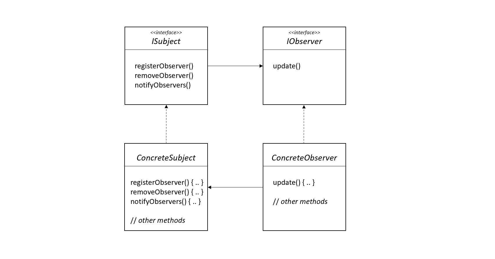
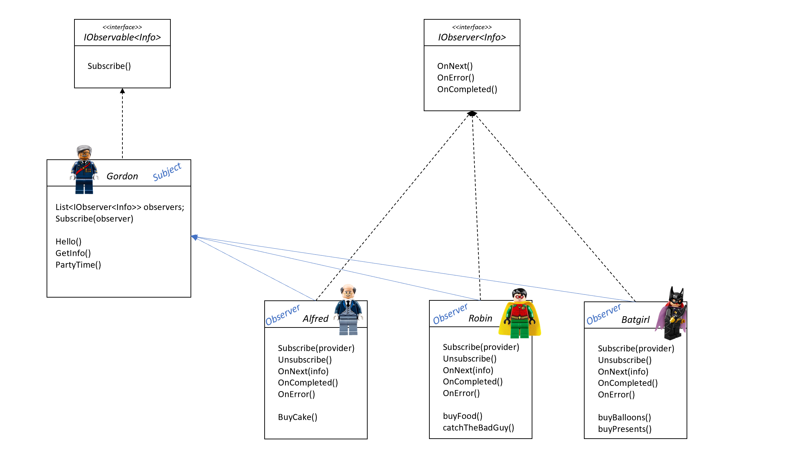
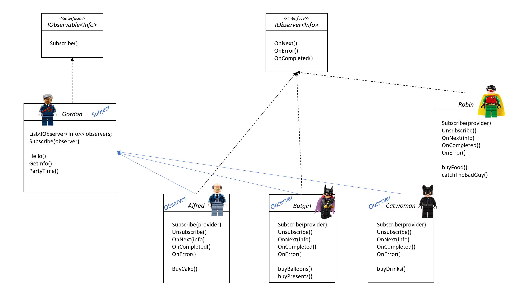

# Observer Pattern

The Observer Pattern defines a one-to-many dependency between objects, so that when one object changes state, all of its dependents are notified and updated automatically.

## Problem

We have *one subject* and *many observers*, who need to be notified whenever something in the subject changes. To give a concrete example, you can think about multiple displays (*observers*) that should be updated whenever the value of a temperature sensor (*subject*) changes.

That means that the observser are *dependent* on the subject, they can interact, but they need to have very little knowledge of each other. We want to be able to add, remove, replace observers easily at any time, without changing the code of the subject. We also want to reuse subject and observers independently of each other.

Last but not least, we want a design that follows these basic principles:

- separate the aspects of the application that may vary from what stays the same
- program to an interface and not to an implementation
- strive for loosely coupled designs between object that interact

## Solution



As you can see, a concrete subject implements *ISubject* and its methods: it will be able to add and remove observers and it will use *notifyObservers()* to update all the current observers whenever its state changes. Of course, the concrete subject can also have other methods, for getting and setting its state, for example.

All the potential Observers need to implement *IObserver* and the *update()* method, which is called when the Subject's state changes. Please note that any class can be an observer, it just needs to implement *IObserver* interface and register with a concrete subject.

Going a little bit deeper into the solution, we have 2 options for the observer to get the update: either the Subject *pushes* the data to all the observers, or each observer *pulls* the data as needed. Even though this is an implementation detail, generally speaking *pulling* the data is a more flexilbe approach: each observer can pull just the data it requires, instead of getting all the data the subject want to share.

### Advantages of this solution

- Subject and observers are *loosely coupled*: the only thing that the subject knows about an observer is that it implements the *IObserver* interface.

- It's easy to add new observers at any time, without modifying the subject.

- Subject and observers can be reused independently of each other.

- Changes to either subject or observers will not affect the other.

## How to use it? A fun example

Today it's Batman birthday! Robin, Batgirl, Gordon and Alfred want to organize a surprise party, but they need coordination to make it a real surprise.

Gordon asked Batman to go the police station to help with an important case, but his actual goal is to notify Alfred, Robin and Batgirl about their movements and other information, so that they have time and space to set up the party: Batgirl is in charge for buying ballons and presents, Alfred will take care of the cake, and Robin will buy some food.

In this scenario Gordon is the *Subject*: as soon as Batman arrives in the police station, he will notify all the *observers* (Robin, Alfred and Batgirl) that they can safely go out and buy whatever they need.

*Please notice that in this sample we are using C# code, so we leverage the existing interfaces for both subject and observers: IObservable and IObserver respectfully. Names and methods are slightly different compared to what we showed above, please review the [official documentation](https://docs.microsoft.com/en-us/dotnet/standard/events/observer-design-pattern) if you need more details about the observer pattern in C#*



Gordon will not only keep Batman busy, but will also try to gather some information that might be useful for his friends: Batman's current location and hunger level and *pushes* these `Info` to its observers.

Suddendly Catwoman shows up at the police station and tells Gordon that she also want to be part of the celebration. She will take care of the drinks, so she needs be notified by Gordon like all the others. In the meantime, Robin found a wanted criminal and needs to catch him, so he cannot handle all the notification from Gordon: he removes himself from the list of the observers for a while.



Any of the observser can register or remove himself very easily, with no changes required on the subject side. You can take a look at the code in the ObserverSample to see the details of this simple implementation.

### How to run the sample application

If you are curious and want to take a look at the sample app, just run this commands:

```ps
cd ObserverSample
dotnet run
```

This is the initial output you should get:

```
Hello there, I'm Gordon and I will keep Batman busy to help you guys organize his surprise party.
------------------------------------------------
Alfred: subscribed
Robin: subscribed
Batgirl: subscribed
------------------------------------------------
Alfred: latest info from Gordon -> location: Police station, Batman is hungry
Robin: latest info from Gordon -> location: Police station, Batman is hungry      
Batgirl: Latest info from Gordon -> I only care about the location: Police station
...
```

*Spoiler alert: the big plan succeeded and at the end of the day Batman and friends celebrated with an amazing surprise party!*
