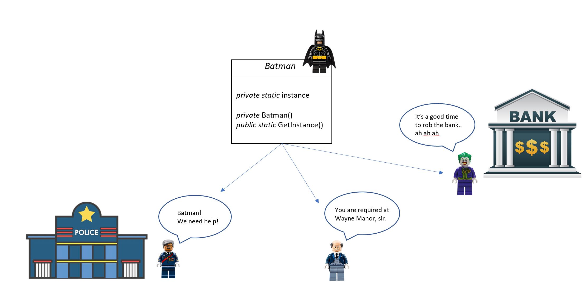

# Singleton Pattern

The Singleton Pattern ensures a class has only one instance, and provides a global point of access to it.

## Problem

We want to be sure that `one and only one` instance of a class can be created, and we want to have a global point of access to that object. It can be very useful for logging, configuration settings, and also in combination to the Factory pattern, in case we want to be sure to have only one Factory able to create components in our system.

We may need to deal with multi-threading applications, and still we want to make sure that our instance is really unique.

## Solution

As you can see below, the Singleton Pattern is very simple, just a single class with:

- a `static` attribute, called *instance*
- a `private` and parameterless constructor
- a `public static` method to generate the single instance of the class: *GetInstance()*
- the class should also be `sealed`, so that it cannot be inherited

The static `GetInstance` method must have the logic to avoid the creation of multiple instances. Actual implementations can be slightly different, depending on the requirements of the system. Here some examples:

- [No Thread-Safe Singleton implementation](#no-thread-safe-singleton-design-pattern)
- Thread-Safety Singleton implementation
- Thread-Safety Singleton implementation using Double-Check Locking
- Thread-Safe Singleton implementation without using the locks and no lazy instantiation
- [`Lazy<T>` type](#lazy-type-for-thread-safe-singleton-design-pattern)

## Advantages

These are the most relevant advantages of the Singleton Pattern:

- it provides a single point of access to a specific instance
- it's easy to use, thanks to static initialization and lazy loading
- it can implment interfaces

However, we need to take into account also some disadvantages: using the Singleton Pattern with locks reduces the potential for parallelism, and having a global state in the application could introduce some challenges in unit tests.

## How to use it

Let's use Batman as an example: of course we all know that there is `one and only one` Batman! But Gotham City is a dangerous place, a lot of people needs help.



We are going to show a couple of different implementations, both valuable if aligned with your specific system requirements.

### No Thread-Safe Singleton Design Pattern

This is the easiest implementation, designed for single-thread systems.
As you can see, the instance is lazy-loaded, after checking if there is already an existing instance of Batman.

```csharp
    public sealed class Batman
    {
        // static instance
        private static Batman instance = null;

        // private parameterless constructor
        private Batman() { }

        // public method to return the single instance - no thread-safe
        public static Batman Instance
        {
            get
            {
                if(instance == null)
                {
                    instance = new Batman();
                }
                return instance;
            }
        }
    }

```

It's very important to notice that this solution does not support multi-thread systems: if 2 threads request a Batman instance concurrently, they both could see the instance as null and they would end up creating 2 different instances of Batman, violating the Singleton Pattern.

The code in the `SingletonSamples` folder shows what happens both with a single-thread and a multi-thread application using the `BatmanNTS` class. Its implementation is almost identical to the one showed above, but we added a unique ID to be able to identify the instance created in the application. 

Here's the output of the `SingleThreadApp`:

```
Gordon needs Batman's help!
... new instance of Batman created: BW781
Don't panic! Batman BW781 is here, with his Batmobile!
Now Alfred needs Batman at the Wayne Manor.
Don't panic! Batman BW781 is here, with his Batmobile!
Oh no, Joker is robbing the bank!
Don't panic! Batman BW781 is here, with his Batmobile!
```

And here's the output of the `MultiThreadApp` using `no thread-safe` parameter:

```
Alfred needs Batman's help!
Gordon needs Batman's help!
Oh no! Joker is robbing the bank!
... new instance of Batman created: BW330
... new instance of Batman created: BW295
Alfred's request: BW295 is coming.
Gordon's request: BW330 is coming.
Gordon's Request: Don't panic! Batman BW330 is here, with his Batmobile!
Alfred's Request: Don't panic! Batman BW295 is here, with his Batmobile!
... new instance of Batman created: BW348
Joker's request: BW348 is coming.
Joker's Request: Don't panic! Batman BW348 is here, with his Batmobile!
```

As you can see, the order of the requests can be different, but the most important thing to notice is that the Batman instance is created multiple times by the different threads, in fact we can see different unique ids.

There are different ways to have a thread-safe implementation of the Singleton pattern, for example by using locks or no lazy instantiation. However, we want to focus on a new easy implementation, by using `Lazy<T>`.

### Lazy type for Thread-Safe Singleton Design Pattern

```csharp
public sealed class Batman
    {
        // static lazy instance
        private static readonly Lazy<Batman> instance = new(() => new Batman() );

        // private parameterless constructor
        private Batman() { }

        // public method to return the single instance
        public static Batman Instance
        {
            get
            {
                // lazy initialization is thread-safe
                return instance.Value;
            }
        }
    }
```

By using the `Lazy<T>` type implementation, the code looks clean and the initialization of the resource is by default thread-safe. However, the object is not protected after creation. Please, refer to the [official documentation](https://docs.microsoft.com/en-us/dotnet/api/system.lazy-1?view=net-5.0) for all the details.

We can take a look at the output of `MultiThreadApp` using `lazy` parameter:

```
Oh no, Joker is robbing the bank!
Gordon needs Batman's help!
Now Alfred needs Batman at the Wayne Manor.
... new instance of Batman created: BW478
Gordon's request: BW478 is coming.
Alfred's request: BW478 is coming.
Alfred's Request: Don't panic! Batman BW478 is here, with his Batmobile!
Gordon's Request: Don't panic! Batman BW478 is here, with his Batmobile!
Joker's request: BW478 is coming.
Joker's Request: Don't panic! Batman BW478 is here, with his Batmobile!
```

As you can see, here `one and only one` instance of Batman is created (unique id: BW478), and it's used by all the different threads.

### How to run

To run the sample app, you just need to run this commands:

```ps
cd SingletonSamples
dotnet run
```

By default, the sample runs the `SingleThreadApp` and this is the ouput you should see:

```
Gordon needs Batman's help!
... Creating an new instance of Batman ...
Don't panic! Batman is here, with his Batmobile!
Now Alfred needs Batman at the Wayne Manor!
... Same old instance of Batman ...
Don't panic! Batman is here, with his Batmobile!
Oh no, Joker is robbing the bank!
... Same old instance of Batman ...
Don't panic! Batman is here, with his Batmobile!
```

You can easily explore the multi-thread solutions described above and see different outputs just by commenting/decommenting the different methods in `Program.cs`.
