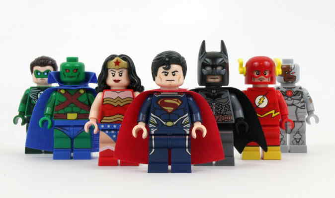
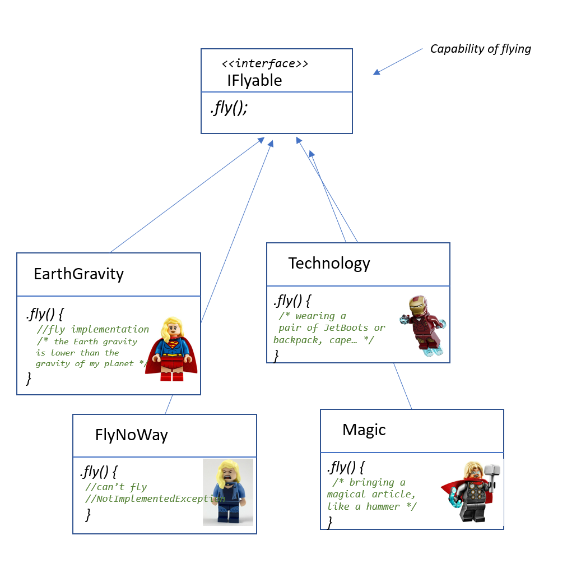
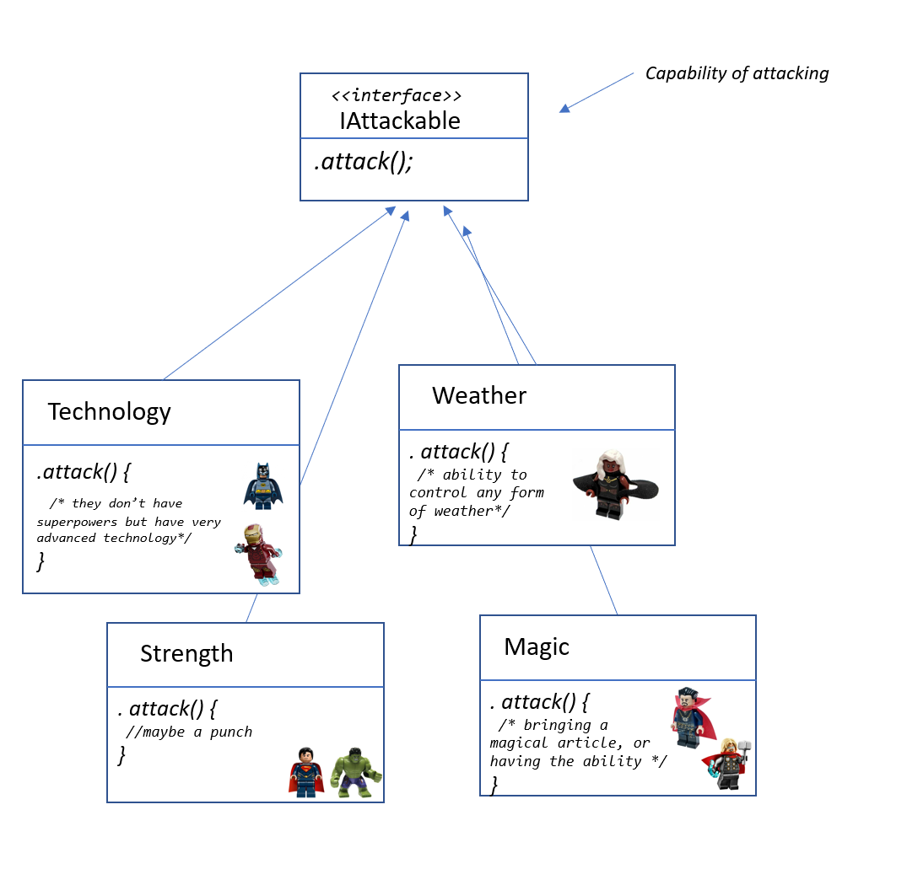
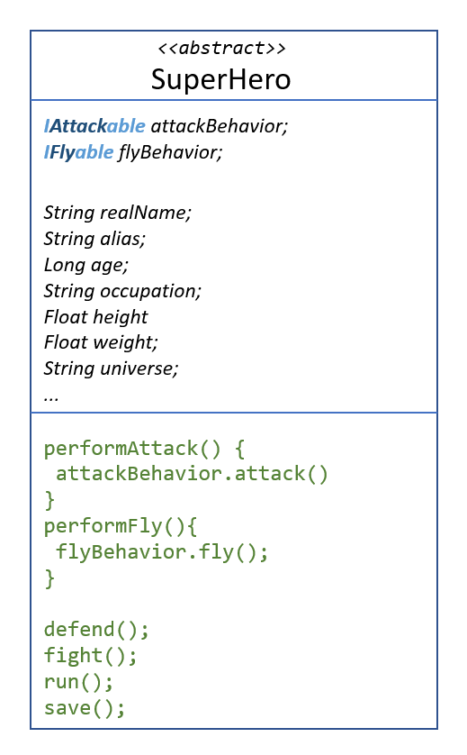
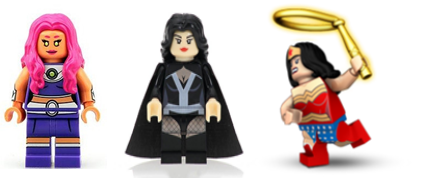
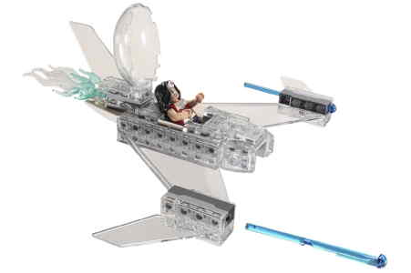
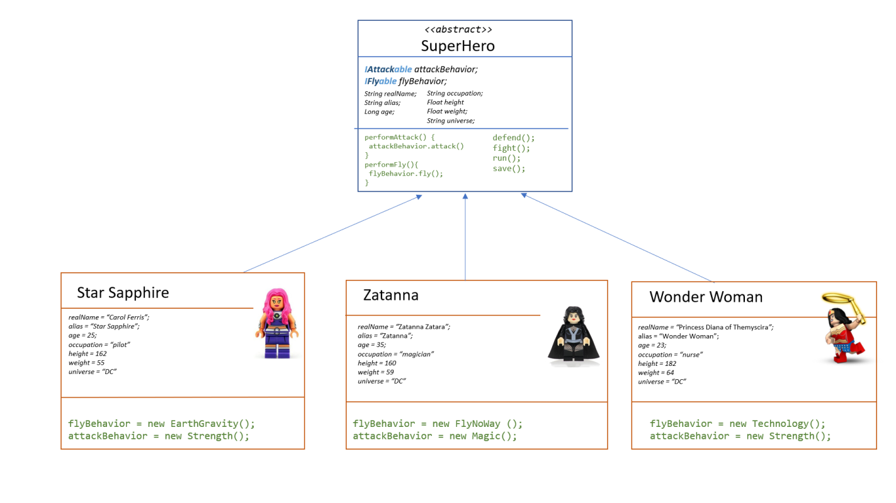

# Strategy Pattern

The Strategy Pattern defines a family of algorithms, encapsulates each one, and makes them interchangeable.
Strategy lets the algorithm vary independently from clients that use it.

## The problem

When we have several types of "something", and all these types have the same functionalities/behaviors, but the way to be held is different among all of them, but sometimes they have some of them in common.

**For example**: we have several types of birds of prey, all of them can fly, but some of them flap a lot their wings like hawks, sparrow hawk, or not moving them a lot and getting advance of the air flows (they fly in circles), like eagles, buzards, condors or owls.


**Another example**: we have several types of cars, all of them can brake, but some of them use cam brakes, others use disc brakes, and others use wedge brakes.

**Another one**: animals can move: Some of them **walk** (dogs, cats, humans), others **jump** (kangoroos or rabits, grasshopper -_saltamontes, gafanhoto, cavalletta, grashüpfer_-), **swim** (tuna, sharks, whale, pinguin ) or **fly** (pigeon, dove), **crawl** (snakes, worms, snails).

The functionality/behavior is common, but the way to do this is different sometimes.

So if we think about this as object, we could have an abstract or parent class "animals" with a method "move" (and maybe a implementation of any move, for example walk - or not-), but then all the children classes need their own implementation of "move".

- The class dog, has "walk" as implementation of "move".
- The class cat, has "walk" as implementation of "move".
- The class horse, has "walk" as implementation of "move".

Imagine that "walk" is a 20 lines of code method, and we have a lot of code replicated on each child class.

## The solution

Of course we need to have another function with that common code. To separate this code, that implements different behavior, we will add the method to the abstract class and then we will create a new set of classes to represent each behavior.


We could have more behaviors associated to animals, like eating, breathing, etc...

So, with this design, the implementation of walking won't be in the cat class, or in the dog class.

_We can add new behaviors without modifing any of our existing behaviors._  -> Do you recongnize this? Yes, it is the "O" of Solid. Open/Close principle.

### How to use it? 

We have an abstract class "Animal" that has one variable that is _a delegate_. Or that _hold a reference_ to the method/behavior/function. Function pointer. You can call it whatever you want.
The important thing: is a reference to something that implement the action "move".

When we create the children classes (concrete animals, like cat, dog, tuna, sneil or rabbit), the references, or delegates are set:


(This is still not perfect: we shouldn't program to an implementation, associating the concrete method "MoveWalking" to a cat, but we'll see another pattern to fix it.)

## Another example with Superheroes
 
We are creating an application about superheroes. On the design we see that superheroes have some superpowers in common. In fact there are several superpowers and abilities that a lot of of them share. Like flight, invisibility, extraordinary strength, super speed or move things without touching them. 



But the explainations behind the same behaviour can be a little bit different among them. <br>
For example, about **flying**: some of them leverage advanced technology to fly, like Ironman, who has jetboots; or Batman, who can use the cape, the batmobile or a backpack; Thor that uses the magic of the hammer; or Superman, that comes from another planet with more gravity than the Earth.
The same happens when they **fight**, because all of them can **attact and defend themselves**, but they have different ways to do it: Spiderman uses the spider organic webbing, Superman and Hulk use their strenght, Storm from X-Men can control the weather or the air pressure, or Dr. Strange uses magic.

All my superheroes can fight, but not all can fly.

So, here, we detect two behaviours: Fly and Attack.
In terms of interface, the capability of flying of our superheroes will be named "Flyable" and the one of attacking (fighting) will be named "Attackable".

We have a lot of superheroes that can fly, but they fly in different ways. 
Let's just pick four ways to fly, although we could have much more, of course. Superheroes that can fly thanks to very advanced technology, like Ironman or Batman, or thanks to a magical object, like Thor, who flies with the hammer. 
It's difficult to say why some of them have a natural physical ability for flying, but one of the explanations is that their original planet density was bigger than the Earth density, so they can escape the gravity: like Supergirl, Superman or Sapphire. 

My interfaces will be "IFlyable" (the superhero can fly), and "IAttackable" (the superhero can attack).<br>
(Because my example will be in C# and...do you remember that best practices for interface naming in C# was starting with "I" (for Interface) and add the suffix -able? ) [Reference here](https://blog.submain.com/c-interface-definition-examples).

Finally, the interface of the flight behaviour, implemented by all our superheroes, looks like this schema:



See that not all superheroes can fly, like Hulk or Black Canary, so we have a class that represents a behaviour called "FlyNoWay".

But they all can fight, and they need an "attack" action/behaviour. 
They use different capabilities or skills to do it: some of them don't have a superpower, like Batman, who mainly uses the technology. A lot of them who are very very strong: like Superman, Spiderman, Hulk, Wonderwoman. Less common is to owe magic, or a magical article, like Thor who has the hammer, or Dr. Strange or Zatanna Zatara, whose superpower is real magic!

The interface of the attacking behaviour, implemented by all our superheroes, looks like this schema:




In the abstract class SuperHero we will have (again) two delegates (in C#), or funtion pointers (in C).
These two properties will be overwritten in the child class, with a concrete method.

Notice that we have two methods "performAttack" and "performFly" **implemented** the abstract class.
When we want our (concrete) superhero to "fly", we'll call "performFly". Depending of the type of superhero, it will act accordingly.  



We could have a lot of properties for the heroes, but just for our example we added the basic ones.

Let see how to implement three concrete heroines: [Star Shapphire](https://en.wikipedia.org/wiki/Star_Sapphire_(character)), [Zatanna](https://en.wikipedia.org/wiki/Zatanna) and [Wonder Woman](https://en.wikipedia.org/wiki/Wonder_Woman).




https://hero.fandom.com/wiki/Star_Sapphire_(DC_Comics) <br>
https://www.dccomics.com/characters/zatanna <br>
https://www.dccomics.com/characters/wonder-woman <br>

After the properties of our super heroines (name, occupation, etc...) our object delegates (flyBehavior and attackBehavior) are going to refer the specific implementation of those behaviours.

For example, Star Sapphire, as Superman, comes from another planet (from [Oa](https://en.wikipedia.org/wiki/Oa)) and she can fly as well because of the density difference with Earth.

Wonder Woman can fly thanks to a "transparent aircraft".



So the implementation of the concrete super heroines will be like this:



You can find the implementation of the superheroes sample in this repo, in the strategy/Superhero folder.
Also you can see how to use ``Superhero`` class in the ``Program.cs`` file:

```
    Superhero heroine1 = new Wonderwoman();            
    heroine1.Introduction();
    heroine1.performAttack();
    heroine1.performFly();
``` 
Output: 

```
Hi! My name is Princess Diana of Themyscira, but I'm more known as Wonder Woman
The way I fight against my enemies is using my huge strength
I use a very advance technology for flying: jet boots, aircrafts, or a very cool cape made of fabric from the future.
``` 


