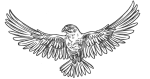
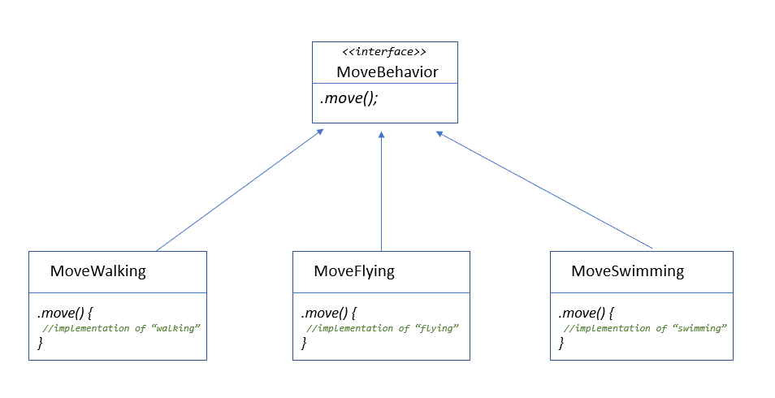
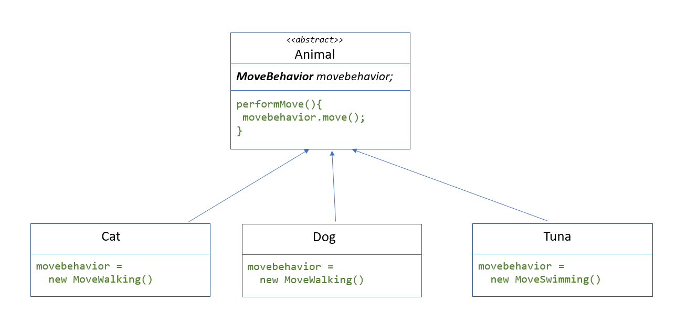
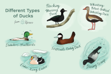
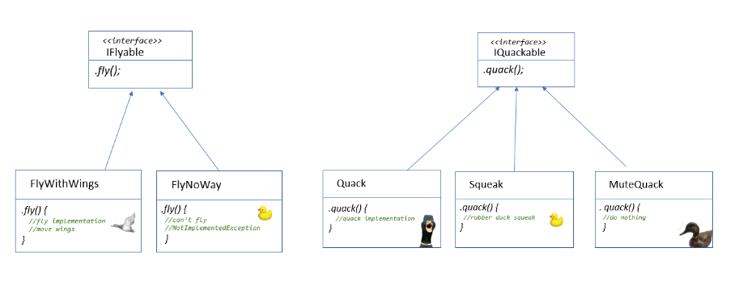
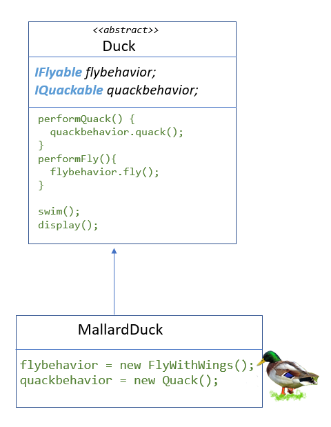

# Strategy Pattern

The Strategy Pattern defines a family of algorithms, encapsulates each one, and makes them interchangeable.
Strategy lets the algorithm vary independently from clients that use it.

## The problem

When we have several types of "something", and all these types have the same functionalities/behaviors, but the way to be held is different between all of them, but sometimes they have some of them in common.

**For example**: we have several types of birds of prey, all of them can fly, but some of them flap a lot their wings like hawks, sparrow hawk, or not moving them a lot and getting advance of the air flows (they fly in circles), like eagles, buzards, condors or owls.




**Another example**: we have several types of cars, all of them can brake, but some of them use cam brakes, others use disc brakes, and others use wedge brakes.

**Another one**: animals can move: Some of them **walk** (dogs, cats, humans), others **jump** (kangoroos or rabits, grasshopper -_saltamontes, gafanhoto, cavalletta, grashüpfer_-), **swim** (tuna, sharks, whale, pinguin ) or **fly** (pigeon, dove), **crawl** (snakes, worms, snails).

The functionality/behaviour is common, but the way to do this is different sometimes.

So if we think about this as object, we could have an abstract or parent class "animals" with a method "move" (and maybe a implementation of any move, for example walk - or not-), but then all the children classes need their own implementation of "move".

- The class dog, has "walk" as implementation of "move".
- The class cat, has "walk" as implementation of "move".
- The class horse, has "walk" as implementation of "move".

Imagine that "walk" is a 20 lines of code method, and we have a lot of code replicated on each child class.

## The solution

Of course we need to have another function with that common code. To separate this code, that implements different behavior, we will add the method to the abstract class and then we will create a new set of classes to represent each behavior.



We could have more behaviors associated to animals, like eating, breathing, etc...

So, with this design, the implementation of walking won't be in the cat class, or in the dog class.

_We can add new behaviors without modifing any of our existing behaviors._  -> Do you recongnize this? Yes, it is the "O" of Solid. Open/Close principle.

### How to use it? 

We have an abstract class "Animal" that has one variable that is _a delegate_. Or that _hold a reference_ to the method/behavior/function. Function pointer. You can call it whatever you want.
The important thing: is a reference to something that implement the action "move".

When we create the children classes (concrete animals, like cat, dog, tuna, sneil or rabbit), the references, or delegates are set:



(for not program to an implementation, I mean, not to associate the concrete method "MoveWalking" to a cat, we'll see another pattern to fix it.)

## Another example with ducks 
Let's imagine we have several type of ducks:

The domestic duck, the mallard duck, the sea duck, the rubber duck bath, and the duck decoy.

<br>
image from: [Identifying the 12 Types of Ducks](https://www.thespruce.com/types-of-ducks-387310)

All my ducks can swim, but not of all them can fly neither quack.
So the behaviors I need to separate (because they are the different ones) are: Quack and Fly.

My interfaces will be "IQuackable" (the duck can quack), and "IFlyable" (the duck can fly).<br>
(Because my example will be in C# and...do you remember that best practices for interface naming in C# was starting with "I" (for Interface) and add the suffix -able? ) [Reference here](https://blog.submain.com/c-interface-definition-examples).



In the abstract class Duck will have (again) two delegates (in C#), or funtion pointers (in C).
This two properties will be overwrite in the child class, with a concrete method.

Notice that we have two methods "performQuack" and "performFly" **implemented** the abstract class.
When we want that our (concrete) duck "speak", we'll call "performaQuack". Depending of the type of duck, it will act accordingly.  



You have the code already implemented in this folder "strategy". 
Also you can see how to use ``MallardDuck`` class</code> in the ``Program.cs`` file:

``` 
Duck mallard = new MallardDuck();
mallard.performFly();
mallard.performQuack();
mallard.swim();
```

Output: 

```
I'm flying!!
Quack!!
All ducks float, even decoys!
``` 
